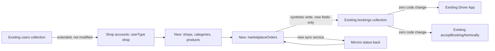
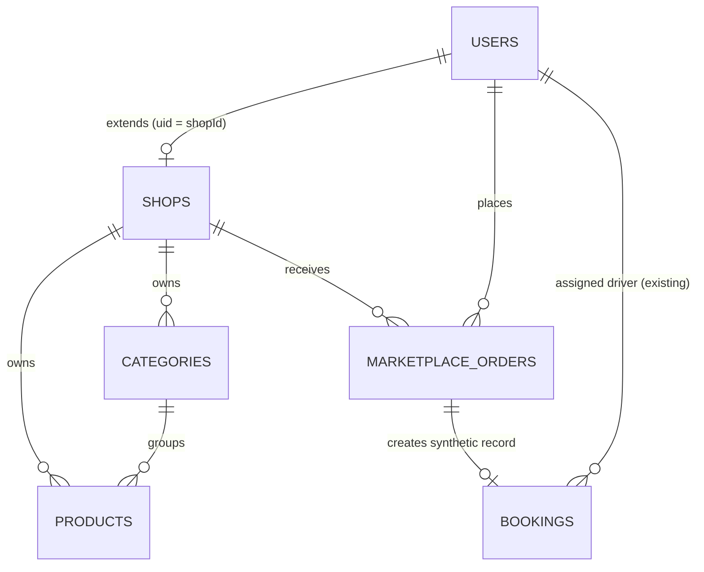
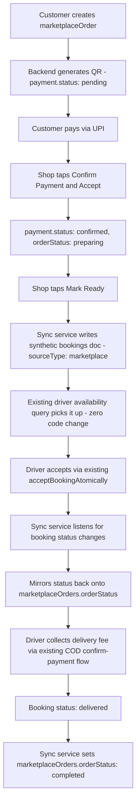
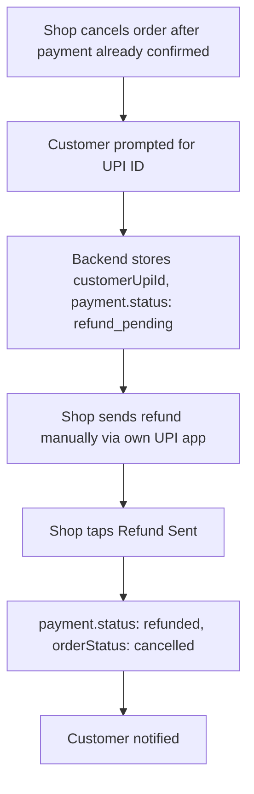

# ePickup Shop App — Architecture Blueprint

**Project:** ePickup Plan 2 — Merchant/Shop App
**Document type:** Technical Architecture Specification (Firestore schema, API contract, system flows, security)
**Version:** 3 (final) — revised twice: first pass closed concurrency/encryption/timeout/crash-reporting gaps, second pass closed dashboard, driver-info sync, profile/compliance/admin endpoints, and Storage/shops security rules
**Companion document:** `ePickup_Shop_App_User_Workflow_Blueprint.md` — every screen and decision here traces back to that document

**Scope boundary:** This document specifies the Shop App's backend, data model, and integration with the existing live system. It does **not** design Customer App, Driver App, or Admin Dashboard screens — but the schema, endpoints, and payment/order contract defined here are the shared foundation those future documents will build directly on top of, not redesign.

---

## Table of Contents

1. [System Integration Map](#1-system-integration-map)
2. [Firestore Data Model](#2-firestore-data-model)
3. [ER Diagram](#3-er-diagram)
4. [API Endpoint Contract](#4-api-endpoint-contract)
5. [Core System Flow — Order to Driver Sync](#5-core-system-flow--order-to-driver-sync)
6. [Refund Flow](#6-refund-flow)
7. [Payment State Machine](#7-payment-state-machine)
8. [Notification Wiring](#8-notification-wiring)
9. [Security Architecture](#9-security-architecture)
10. [Indexing & Query Performance](#10-indexing--query-performance)
11. [Frontend–Backend Contract](#11-frontendbackend-contract)
12. [Rollout Plan](#12-rollout-plan)
13. [Future-Phase Notes](#13-future-phase-notes)
14. [Observability & Crash Reporting](#14-observability--crash-reporting--for-you-not-the-admin-dashboard)

---

## 1. System Integration Map



Every new piece — `shops`, `categories`, `products`, `marketplaceOrders`, and the new route/service files — is additive. The only point of contact with existing, live logic is a single, carefully scoped write into `bookings`, using fields that already exist there plus two new ones (`sourceType`, `marketplaceOrderId`). Nothing existing is edited to make this work.

---

## 2. Firestore Data Model

### 2.1 `users/{uid}` — additions for shop accounts only

Reuses the exact pattern already in production for `customer`/`driver` — no changes to existing auth, session, or notification code.

```
users/{uid}
├── phone: string                    // login identity, locked after signup
├── email: string                    // secondary contact, not login
├── userType: "shop"                 // existing field, new value
├── hasPassword: boolean             // existing pattern (customer.hasPassword)
├── passwordSetAt: timestamp
├── expoPushToken / fcmToken         // existing pattern, unchanged
├── isActive: boolean
├── createdAt / updatedAt
└── shop: {
      shopName: string
      shopType: string               // Restaurant / Supermarket / Hardware / etc.
      approvalStatus: "pending" | "approved" | "rejected"
      rejectionReason: string | null
      isOpen: boolean                // daily open/close, shop-controlled only
    }
```

### 2.2 `shops/{shopId}` — new collection (shopId == uid)

Extended profile data too heavy to nest in `users`. One document per shop.

```
shops/{shopId}
├── address: string                  // reverse-geocoded from map pin
├── location: GeoPoint               // source of truth for distance/maps
├── documents: {
│     gstUrl: string, gstStatus: "verified" | "action_required"
│     fssaiUrl: string, fssaiStatus: "verified" | "action_required"
│     fssaiExpiryDate: timestamp | null   // FSSAI licenses genuinely expire; enables a future renewal-reminder job
│   }
├── bank: {
│     accountHolderName: string
│     bankName: string
│     accountNumberEncrypted: string  // AES-256-GCM, see §9.8
│     accountNumberLast4: string      // plaintext, display only
│     ifsc: string
│     upiId: string                  // live payment destination
│     upiVerified: boolean
│     upiVerifiedAt: timestamp
│   }
└── createdAt / updatedAt
```

### 2.3 `categories/{categoryId}`

```
categories/{categoryId}
├── shopId: string        // reference
├── name: string           // free text, merchant-defined
└── createdAt: timestamp
```

### 2.4 `products/{productId}`

```
products/{productId}
├── shopId: string
├── categoryId: string
├── name: string
├── description: string | null
├── price: number
├── taxClass: string | null
├── weight: number | null
├── barcode: string | null
├── photoUrl: string | null
├── isActive: boolean               // in-stock/out-of-stock toggle
├── stock: number                   // used only if hasVariants = false
├── lowStockThreshold: number
├── hasVariants: boolean            // confirmed built in Figma — fashion category support
├── variants: [                     // present only if hasVariants = true
│     { id, attributeLabel: "Size", value: "M", stock, priceOverride: number | null }
│   ]
└── createdAt / updatedAt
```

### 2.5 `marketplaceOrders/{orderId}` — the core new collection

```
marketplaceOrders/{orderId}
├── shopId: string
├── customerId: string
├── items: [
│     { productId, variantId: string | null, name, price, qty }
│   ]
├── itemsTotal: number              // product cost only — what UPI payment covers
├── deliveryFee: number             // calculated via existing fareCalculation.js, informational here
├── deliveryAddress: { text: string, coordinates: GeoPoint }
├── orderStatus: "awaiting_payment" | "preparing" | "ready" |
│                 "handed_over" | "completed" | "cancelled"
├── payment: {
│     status: "pending" | "initiated" | "customer_claimed" |
│              "confirmed" | "expired" | "refund_pending" | "refunded"
│     shopUpiId: string             // snapshot at order time, survives later UPI ID changes
│     amount: number
│     transactionReference: string  // == orderId, encoded in the QR
│     customerUtr: string | null    // audit trail only, never proof
│     customerUpiId: string | null  // collected only if a refund becomes necessary
│     initiatedAt / confirmedAt / expiredAt / refundedAt: timestamp | null
│     confirmedByShopUid: string | null
│   }
├── cancellation: {
│     reason: string | null
│     cancelledAt: timestamp | null
│     cancelledBy: string | null
│   }
├── linkedBookingId: string | null  // set once the synthetic booking is created
└── createdAt / updatedAt
```

### 2.6 Synthetic write into the **existing** `bookings` collection

This is the single point of contact with production logic. Written by the new sync service when `orderStatus` becomes `"ready"` — using only fields the existing schema already supports, plus two new ones.

```
bookings/{bookingId}                 // written into the EXISTING collection
├── ...all standard existing fields, unchanged shape:
│     status: "pending"
│     pickup: { name: shopName, phone, address, coordinates: shop.location }
│     dropoff: { name: customerName, phone, address, coordinates }
│     package: { description: "Order #<id> — N items", weight: default }
│     fare / pricing: calculated via existing fareCalculation.js
│     paymentMethod: "cash"          // reuses existing COD flow, unchanged
│     paymentStatus: "pending"
├── sourceType: "marketplace"        // NEW field — only marker needed
└── marketplaceOrderId: string       // NEW field — links back to the real order
```

**This is intentionally the entire footprint on the existing system.** Two new field names, zero changed logic, zero changed queries.

---

## 3. ER Diagram



---

## 4. API Endpoint Contract

All new routes live in new files (`routes/shopAuth.js`, `routes/shops.js`, `routes/categories.js`, `routes/products.js`, `routes/marketplaceOrders.js`), following the same `router.method(path, ...)` convention already used throughout the codebase.

### Shop Authentication
| Method | Path | Notes |
|---|---|---|
| POST | `/api/shop/auth/send-otp` | Signup step 1 |
| POST | `/api/shop/auth/verify-otp` | |
| POST | `/api/shop/auth/set-password` | Locks in phone + password as login identity |
| POST | `/api/shop/auth/login` | Phone + password |
| POST | `/api/shop/auth/forgot-password` | |
| POST | `/api/shop/auth/reset-password` | |

### Onboarding
| Method | Path | Notes |
|---|---|---|
| POST | `/api/shop/onboarding/business-details` | Shop name, type, address, map pin |
| POST | `/api/shop/onboarding/documents` | GST + FSSAI upload |
| POST | `/api/shop/onboarding/bank-details` | Includes UPI ID |
| POST | `/api/shop/onboarding/verify-upi` | Validates VPA format before allowing submission |
| POST | `/api/shop/onboarding/submit` | Triggers admin review |

### Dashboard
| Method | Path | Notes |
|---|---|---|
| GET | `/api/shop/dashboard/stats` | Today's Earnings, Total Orders, per-status counts — powers Workflow doc §2.2 |

### Shop Profile & Settings
| Method | Path | Notes |
|---|---|---|
| GET | `/api/shop/profile` | |
| PUT | `/api/shop/profile` | Requires password re-confirmation |
| PUT | `/api/shop/bank-details` | Requires password re-confirm + UPI re-verification |
| PUT | `/api/shop/status` | Open/Closed toggle — shop-controlled only |
| POST | `/api/shop/deactivate` | Honors in-flight-order rule from Workflow doc §6.6 |
| PUT | `/api/shop/documents/:type` | Re-upload GST/FSSAI after approval — reverts that document to "Under Review" (Workflow doc §6.4) |
| PUT | `/api/shop/account/profile` | Change name/username/email (Workflow doc §6.8) |
| PUT | `/api/shop/account/password` | Requires current password + new password twice |

### Categories & Products
| Method | Path | Notes |
|---|---|---|
| GET / POST | `/api/shop/categories` | |
| DELETE | `/api/shop/categories/:id` | Blocked if products still assigned |
| GET / POST | `/api/shop/products` | |
| PUT / DELETE | `/api/shop/products/:id` | |
| PUT | `/api/shop/products/:id/stock` | |

### Orders (Shop-side)
| Method | Path | Notes |
|---|---|---|
| GET | `/api/shop/orders?status=` | |
| GET | `/api/shop/orders/:id` | |
| POST | `/api/shop/orders/:id/confirm-payment` | Combined confirm + accept, per Workflow doc §4.3 |
| POST | `/api/shop/orders/:id/reject` | Only valid pre-payment-confirmation |
| POST | `/api/shop/orders/:id/mark-ready` | Triggers synthetic `bookings` write |
| POST | `/api/shop/orders/:id/confirm-handover` | Matches driver's Order ID/OTP |
| POST | `/api/shop/orders/:id/cancel` | Reason required; triggers refund flow if payment was confirmed |
| POST | `/api/shop/orders/:id/refund-sent` | Closes out the refund flow |

### Consumed by future Customer App (contract defined now, UI later)
| Method | Path | Notes |
|---|---|---|
| POST | `/api/customer/marketplace-orders` | Creates order, generates QR + payment payload |
| GET | `/api/customer/marketplace-orders/:id/payment-status` | Polled or listened to during §4.2 verification screen |

### Consumed by future Admin Dashboard (contract defined now, UI later)
| Method | Path | Notes |
|---|---|---|
| GET | `/api/admin/shops?status=pending` | |
| POST | `/api/admin/shops/:id/approve` | Single bulk decision, per Workflow doc §1.4.5 |
| POST | `/api/admin/shops/:id/reject` | |
| GET | `/api/admin/marketplace-orders/:id/reconciliation` | Order, customer, shop, amount, payment status, customer UTR, all timestamps — powers the dispute-resolution view from Workflow doc §4.6 |

### 4.1 Request/response schemas — the money-touching endpoints

Full schemas for every endpoint would duplicate the data model already given in §2; these three are the ones worth specifying exactly, since they're where real money and real state transitions happen.

**`POST /api/customer/marketplace-orders`**
```json
// Request
{
  "shopId": "string",
  "items": [{ "productId": "string", "variantId": "string | null", "qty": "number" }],
  "deliveryAddress": { "text": "string", "coordinates": { "lat": "number", "lng": "number" } }
}
// Response 201
{
  "success": true,
  "order": {
    "id": "string",
    "itemsTotal": "number",
    "deliveryFee": "number",
    "payment": { "status": "pending", "transactionReference": "string", "shopUpiId": "string", "amount": "number" },
    "qrPayload": "string"   // the upi://pay?... string, server-generated, never client-supplied
  }
}
```

**`POST /api/shop/orders/:id/confirm-payment`**
```json
// Request — deliberately minimal, no amount field accepted from client
{ "confirmedByShopUid": "string" }
// Response 200
{ "success": true, "order": { "id": "string", "payment": { "status": "confirmed", "confirmedAt": "timestamp" }, "orderStatus": "preparing" } }
// Response 200 (already processed — idempotent no-op, see §9.7)
{ "success": true, "message": "Already processed", "order": { "...": "current state" } }
```

**`POST /api/shop/orders/:id/cancel`**
```json
// Request
{ "reason": "string" }
// Response 200 — behavior branches on whether payment was already confirmed
{
  "success": true,
  "order": {
    "orderStatus": "cancelled",
    "payment": { "status": "refund_pending | cancelled" }  // refund_pending only if payment.status was 'confirmed'
  },
  "refundRequired": "boolean"
}
```

---

## 5. Core System Flow — Order to Driver Sync



**The sync service** (`services/marketplaceSyncService.js`, new file) is the one piece of genuinely new logic bridging old and new systems. It listens for updates to `bookings` documents where `sourceType == "marketplace"`, and mirrors two things onto the corresponding `marketplaceOrders` document: the **status** transitions, and — this matters, and was missing from the first draft of this document — the **`driverInfo` object** (name, phone, vehicle details) that the existing assignment system already writes onto the booking. Without mirroring that second piece, the Shop App's handover confirmation screen (Workflow doc §5.4, showing the driver's name and vehicle for the OTP/ID match) would have nothing to display.

### 5.1 Implementation detail — how the sync service actually runs

This matters enough to be explicit about, since it's an infrastructure decision, not just a design idea: **this does not use Firebase Cloud Functions.** Your project has no existing Cloud Functions deployment — everything runs on Railway as a single long-running Express process. Introducing Cloud Functions here would mean standing up an entirely new deployment platform just for this one piece, which is more operational surface than the problem needs.

Instead: the sync service is a **persistent Firestore listener (`.onSnapshot()`) established once at server startup**, inside the existing backend process, using the `firebase-admin` connection already initialized in `services/firebase.js`. It attaches a listener scoped to `bookings` where `sourceType == "marketplace"`, and reacts to changes in real time for as long as the server is running. On a Railway redeploy or restart, the listener simply re-attaches automatically as part of normal server boot — there's no separate service to deploy, monitor, or keep in sync with the rest of the backend.

### 5.2 Implementation detail — payment timeout enforcement

The 15-minute payment timeout (Workflow doc §4.2) needs an active process checking for it — a stated rule alone enforces nothing. This runs as a **scheduled job inside the same backend process**, using `node-cron` (a lightweight, already-common Node package — no new infrastructure):

```javascript
// Runs every 60 seconds inside the existing Express server
cron.schedule('* * * * *', async () => {
  const cutoff = Timestamp.fromMillis(Date.now() - PAYMENT_TIMEOUT_MS);
  const expiredOrders = await db.collection('marketplaceOrders')
    .where('payment.status', 'in', ['pending', 'initiated'])
    .where('createdAt', '<', cutoff)
    .get();

  for (const doc of expiredOrders.docs) {
    await doc.ref.update({ 'payment.status': 'expired', orderStatus: 'cancelled' });
    // trigger existing notification pattern: payment_expired template
  }
});
```

`PAYMENT_TIMEOUT_MS` should be a config value (env var or `appSettings` document, which already exists in your schema), not hardcoded — matching your earlier requirement that this stay admin-configurable.

---

## 6. Refund Flow



Cancellations **before** payment confirmation skip this entirely — `orderStatus: cancelled` directly, no refund needed since no money was ever confirmed as received.

---

## 7. Payment State Machine

| State | Set by | Meaning |
|---|---|---|
| `pending` | Order creation | QR generated, awaiting customer action |
| `initiated` | Customer returns from UPI app | Attempt made, not yet confirmed |
| `customer_claimed` | Customer taps "I've paid" | Informational only — never advances the order alone |
| `confirmed` | Shop taps Confirm Payment | **Authoritative** — the only state that advances the order |
| `expired` | Timeout (15 min default, admin-configurable) | No shop confirmation in time |
| `refund_pending` | Cancellation after confirmation | Awaiting shop's manual refund |
| `refunded` | Shop taps Refund Sent | Closed out |

---

## 8. Notification Wiring

Every notification reuses the existing `notificationService.sendToUser()` / `sendTemplateNotification()` pattern — new templates only, no changes to how notifications are actually sent.

| Trigger | Recipient | Service call |
|---|---|---|
| Payment initiated | Shop | `sendTemplateNotification(shopUid, 'marketplace', 'payment_initiated', {...})` |
| Payment confirmed | Customer | `sendTemplateNotification(customerId, 'marketplace', 'payment_confirmed', {...})` |
| Payment timeout | Customer | `sendTemplateNotification(customerId, 'marketplace', 'payment_expired', {...})` |
| Order ready | Customer + Driver | Existing driver-facing path unchanged; customer via new template |
| Refund initiated | Customer | `sendTemplateNotification(customerId, 'marketplace', 'refund_initiated', {...})` |
| Shop application approved/rejected | Shop | New templates, same `sendToUser` path |

---

## 9. Security Architecture

### 9.1 Firestore Security Rules — shop isolation enforced at the database layer

```javascript
// shops, products, categories: only the owning shop can write
match /products/{productId} {
  allow read: if true; // public catalogue browsing
  allow write: if request.auth.uid == resource.data.shopId
                || request.auth.uid == request.resource.data.shopId;
}

match /marketplaceOrders/{orderId} {
  allow read: if request.auth.uid == resource.data.shopId
               || request.auth.uid == resource.data.customerId
               || request.auth.token.admin == true;
  allow update: if request.auth.uid == resource.data.shopId; // shop-only status changes
}

// shops: holds bank details and compliance documents — private by default,
// unlike products' intentionally public read. This was missing from the first
// draft of this document and is worth being explicit about, given what's stored here.
match /shops/{shopId} {
  allow read: if request.auth.uid == shopId || request.auth.token.admin == true;
  allow write: if request.auth.uid == shopId;
}
```

### 9.2a Firebase Storage rules — a separate system from Firestore, also needed

Firestore security rules only govern documents in the database — GST/FSSAI files and product photos live in Firebase **Storage**, which has its own independent rule set. This needs its own explicit configuration, not an assumption that the Firestore rules above cover it:

```javascript
// storage.rules
match /shops/{shopId}/documents/{fileName} {
  allow read: if request.auth.uid == shopId || request.auth.token.admin == true;
  allow write: if request.auth.uid == shopId
                && request.resource.size < 5 * 1024 * 1024  // 5MB cap
                && request.resource.contentType.matches('image/.*|application/pdf');
}

match /products/{productId}/photos/{fileName} {
  allow read: if true;  // public, matches product catalogue's public-read intent
  allow write: if request.auth.uid == resource.metadata.shopId;
}
```

This means a bug in application-level query logic can never leak Shop A's orders to Shop B — the database itself refuses the read, independent of what the app code does.

### 9.2 Payment integrity

- **QR amount and transaction reference are always server-generated at order creation** — never accepted from the client on any confirmation call, closing off the obvious tampering vector
- **`confirm-payment` checks `req.user.uid === order.shopId`** — a shop can only confirm payment on its own orders, enforced in the endpoint, not just hidden in the UI
- **Idempotency reuses the existing `paymentIdempotency` collection** — the same pattern already protecting parcel payments protects marketplace confirmations too, no new mechanism invented
- **Refund amount is always read from the original order**, never accepted as free input from the shop

### 9.3 Auth & abuse prevention

- OTP requests rate-limited via the existing `rateLimit.js` middleware — prevents SMS-bombing abuse
- Login attempts rate-limited the same way
- Token verification reuses existing Firebase Auth middleware — no parallel auth system

### 9.4 IDOR prevention

Every new endpoint explicitly checks resource ownership server-side (shop owns this product, this order, this category) — never relies on the frontend simply not showing the option.

### 9.5 File upload validation

GST/FSSAI documents and product photos reuse the existing `fileUpload.js` type/size validation — no new upload pipeline.

### 9.6 Admin audit trail

Every shop approval/rejection logged into the existing `adminLogs` collection — who, when, what decision — same pattern already used for existing admin actions.

### 9.7 Concurrency & Idempotency — closing two real race-condition risks

**Stock overselling.** Without protection, two customers ordering the last unit of a product at the same moment could both succeed. Your codebase already established the right pattern for exactly this class of problem — `createBookingAtomically` and `acceptBookingAtomically` both use Firestore transactions to make a check-then-write sequence atomic. Order creation needs the same treatment:

```javascript
// createMarketplaceOrderAtomically — new function, same pattern as existing *Atomically functions
await db.runTransaction(async (tx) => {
  const productRef = db.collection('products').doc(productId);
  const productDoc = await tx.get(productRef);
  const currentStock = productDoc.data().stock;

  if (currentStock < requestedQty) {
    throw new Error('INSUFFICIENT_STOCK');
  }

  tx.update(productRef, { stock: currentStock - requestedQty });
  tx.set(orderRef, { ...orderData });
});
```

Reads and writes happening inside one transaction means Firestore itself guarantees the second concurrent attempt sees the updated stock, not the stale value — no manual locking needed.

**Double-tap protection on shop actions.** `confirm-payment`, `mark-ready`, `confirm-handover`, and `cancel` each need to check the order's *current* status before applying their transition, and no-op safely if it's already been applied:

```javascript
// Pattern applied to every shop-triggered status transition
if (order.payment.status !== 'initiated') {
  return res.status(200).json({ success: true, message: 'Already processed', order });
}
```

This isn't just tidiness — without it, a laggy connection causing two rapid taps could fire duplicate notifications, double-write timestamps, or in the worst case, race against the sync service's own updates.

### 9.8 Bank account number encryption — concrete approach

Given this is a solo-developer project on Railway (not a large team with a dedicated KMS setup), the right-sized approach is **field-level encryption using Node's built-in `crypto` module (AES-256-GCM)** rather than introducing a managed key-management service — proportionate security without unnecessary operational overhead:

```javascript
// utils/encryption.js — new file
const crypto = require('crypto');
const KEY = Buffer.from(process.env.BANK_ENCRYPTION_KEY, 'hex'); // 32-byte key, Railway env var, never in code/git

function encryptAccountNumber(plainText) {
  const iv = crypto.randomBytes(12);
  const cipher = crypto.createCipheriv('aes-256-gcm', KEY, iv);
  const encrypted = Buffer.concat([cipher.update(plainText, 'utf8'), cipher.final()]);
  const authTag = cipher.getAuthTag();
  return Buffer.concat([iv, authTag, encrypted]).toString('base64');
}
```

The key itself lives only in Railway's environment secrets, generated once (`openssl rand -hex 32`), never committed to git, never logged. Decryption only happens server-side when genuinely needed (e.g., a future payout integration) — the app and Admin Dashboard only ever read `accountNumberLast4`.

### 9.9 Extending existing Sentry coverage

Your stack already includes Sentry — new marketplace routes, services, and the sync service should report into that **same existing Sentry project**, not a separate one. Practically: wrap new route handlers with the same error-capturing middleware pattern already applied to existing routes, so a crash in `marketplaceOrders.js` shows up in the same place you already check for `booking.js` issues, not a second dashboard to remember. Full mobile-side Sentry setup for the Shop App itself is covered in §14, since that's where your crash-reporting request lives.

---

## 10. Indexing & Query Performance

| Collection | Composite index needed | Powers |
|---|---|---|
| `marketplaceOrders` | `(shopId, orderStatus, createdAt desc)` | Shop's filtered order list (Workflow doc §5.1) |
| `marketplaceOrders` | `(shopId, payment.status)` | Payment reconciliation views |
| `products` | `(shopId, categoryId)` | Catalogue filtering by category |
| `products` | `(shopId, isActive)` | Hiding out-of-stock items from customer browsing |
| `categories` | `(shopId)` | Already covered by single-field index, no composite needed |

**No new indexes needed on `bookings`** — the existing `status` + `createdAt` index already serves the synthetic marketplace bookings identically to parcel ones, confirming true zero-footprint on that collection.

---

## 11. Frontend–Backend Contract

- **Auth:** standard Firebase Auth ID token in `Authorization: Bearer <token>` header, matching every existing app
- **Error shape:** consistent with existing API — `{ success: false, error: { code, message } }`
- **Live data (order status, payment status):** Firestore listener on `marketplaceOrders/{orderId}` directly from the app — no polling needed, matches how the existing apps already use Firestore + REST together
- **Mutations (create product, confirm payment, etc.):** standard REST calls to the endpoints in §4

---

## 12. Rollout Plan

1. New collections and routes built on `marketplace-dev` branch (backend repo)
2. Tested against staging Firebase project + staging Railway service
3. Shop App built against the same staging environment via EAS `development` profile
4. Once verified, `marketplace-dev` merges into `main`
5. Production Railway (already connected to the live `Epickup-app` project) deploys the merged code
6. First real shop signup is the moment `shops`, `products`, etc. exist in production — no manual migration step, per Firestore's auto-create-on-write behavior
7. Zero downtime, zero risk to existing Customer/Driver/Admin traffic at any point in this sequence

---

## 13. Future-Phase Notes

- **Payment Phase 2** (Razorpay Route or similar), if ever revisited, slots into the existing `payment` object on `marketplaceOrders` without schema changes — only the mechanism producing `confirmed` status would change, not the data model
- **Fashion/variant support** is already built into the `products` schema (`hasVariants`, `variants[]`) — no future migration needed there
- **Customer App architecture doc** will consume `POST /api/customer/marketplace-orders` and the order/payment schema exactly as defined here
- **Admin Dashboard architecture doc** will consume the `/api/admin/shops` endpoints and `adminLogs` pattern exactly as defined here

---

## 14. Observability & Crash Reporting — for you, not the Admin Dashboard

This section is explicitly *not* the Admin Dashboard's business reporting (order volumes, shop performance, etc.) — that's a future, separate concern. This is the developer/DevOps layer: how *you* find out something broke, fast, on your phone, without opening a dashboard and hunting.

### 14.1 Mobile crash reporting — Sentry React Native SDK in the Shop App

Your stack already uses Sentry — this extends it to the new Shop App specifically, rather than introducing a second tool:

```javascript
// App entry point
import * as Sentry from '@sentry/react-native';

Sentry.init({
  dsn: process.env.SENTRY_DSN,
  environment: process.env.APP_ENV,   // 'staging' | 'production' — separates noise cleanly
  release: `shop-app@${Constants.expoConfig.version}+${Constants.expoConfig.ios.buildNumber}`,
  tracesSampleRate: 0.2,              // performance tracing, light sampling to control cost
});
```

This automatically captures JS crashes, native crashes, and unhandled promise rejections — no manual try/catch needed everywhere for baseline coverage.

### 14.2 Source maps — the detail that makes crash reports actually readable

Without this, a production crash report shows minified variable names and is nearly useless. Add a Sentry upload step to your EAS build hook (`eas.json` → `hooks.postPublish` or a build-time script) so every release automatically uploads its source maps to Sentry, tagged to that exact release string from §14.1. This is a one-time setup, not an ongoing task.

### 14.3 Context tagging — so a crash report tells you *which shop, which order*

A generic "TypeError: undefined" is far less useful than one tagged with exactly where it happened:

```javascript
Sentry.setContext('order', { orderId, shopId, orderStatus });
Sentry.setTag('screen', 'PaymentConfirmationScreen');
```

Apply this at the top of every major screen and around every payment/order action — the cost is a few lines per screen, the payoff is never having to ask "which shop hit this?" after the fact.

### 14.4 Real-time push alerts — genuinely on your phone

This is the part that answers "reporting automation in the mobile" directly: **install the Sentry mobile app** (iOS/Android) and configure Alert Rules in your Sentry project:

- New issue type appears → instant push notification
- Error rate on a specific transaction (e.g. `confirm-payment`) spikes above a threshold → push notification
- A crash occurs in a payment-related screen specifically → higher-priority alert, since that's where money is involved

No dashboard-checking required — the alert reaches your phone the same way a text message would, the moment something breaks, whether you're at your desk or not.

### 14.5 Backend error tracking — same Sentry project, new files covered

The Node SDK, already presumably wired into your existing backend, gets applied to the new marketplace route/service files the same way — no separate setup, no separate project, just coverage extended to new code as it's written.

### 14.6 Backend uptime — reusing what you already built

Your backend already exposes `/health` and `/api/health/detailed` — built, live, unused for this purpose until now. Point a free-tier uptime monitor (Better Stack, UptimeRobot, or similar — pick whichever's simplest to set up) at that existing endpoint, checking every 1-2 minutes. If the whole Railway service goes down — not just an in-app error, but genuinely unreachable — you get a separate alert for that too, since Sentry alone can't tell you "the server didn't respond at all."

### 14.7 Internal error log, kept in sync with Sentry

Your schema already includes an `errorLogs` collection from the existing system. New marketplace error paths should continue writing into it alongside reporting to Sentry — Sentry gives you the real-time alert and stack trace, `errorLogs` keeps a queryable record inside your own data for anything you want to cross-reference against order/shop data later.

---

*End of document — Version 2 (final). This is the technical foundation for Shop App development, and the shared base that future Customer App and Admin Dashboard architecture documents will build directly on top of.*
