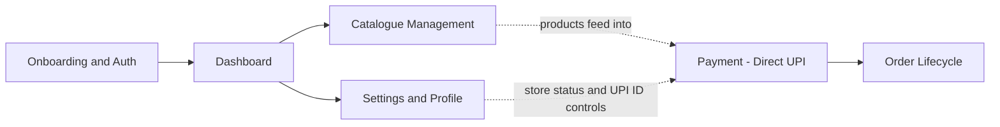
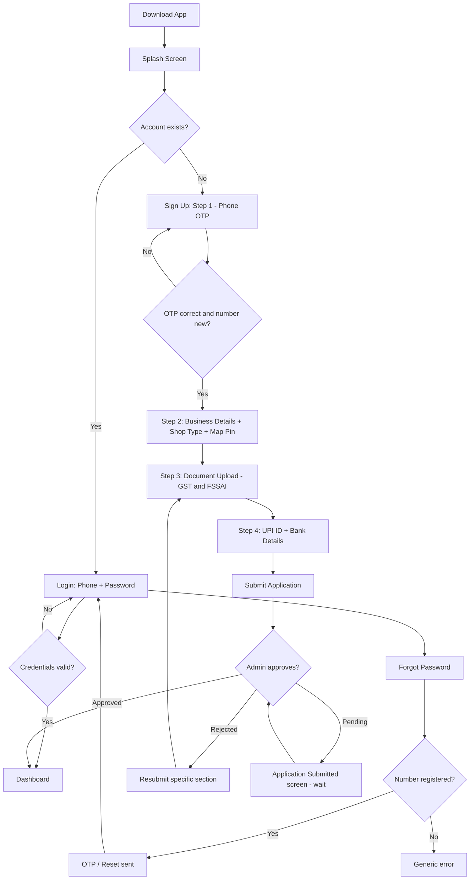
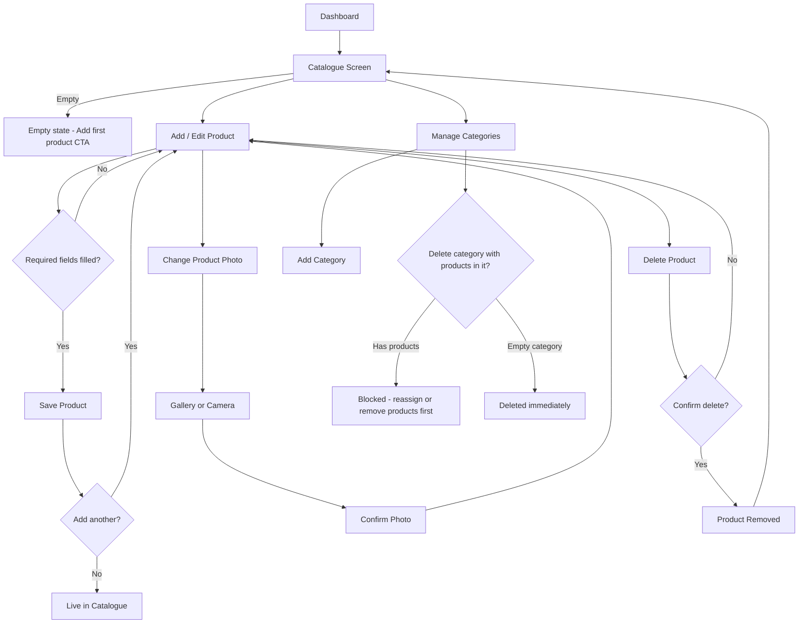
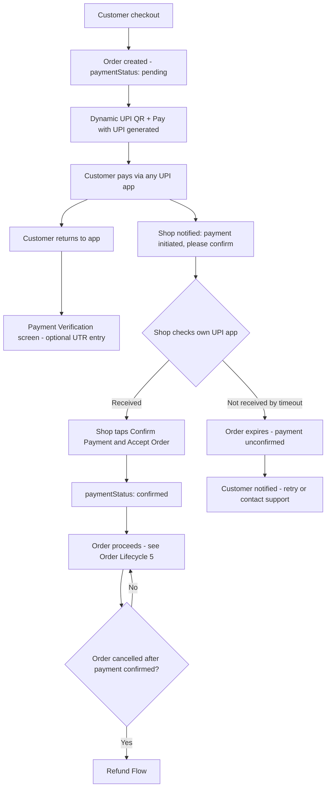
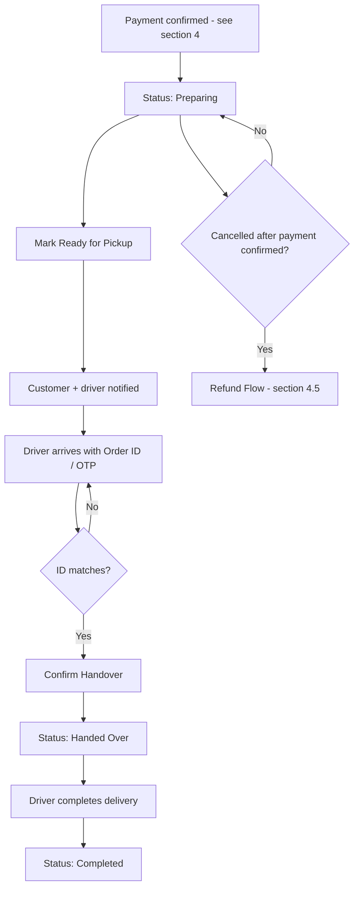
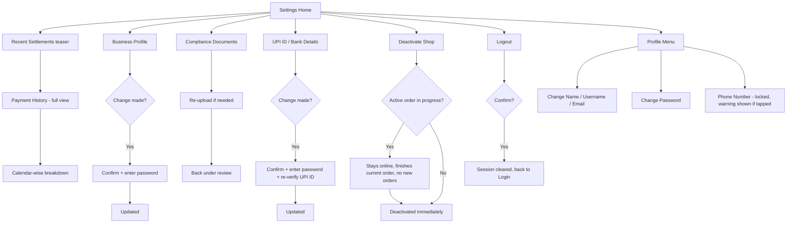

# ePickup Shop App — User Workflow Blueprint

**Project:** ePickup Plan 2 — Merchant/Shop App
**Document type:** UI/UX Workflow Specification (source document for development)
**Version:** 4 (final)
**Scope:** Every screen, state, and decision in the Shop App — onboarding through daily operation, including the full Customer-to-Shop payment flow.

---

## Executive Summary

This document is the complete behavioral specification for the ePickup Shop App and its payment model, covering **6 modules and 49+ Figma-designed screens/states**. It describes what a shop owner (and, where relevant, the customer) sees and does — not backend logic, APIs, or database structure, which live in the separate Architecture document that follows this one.

**What's new in this version:** a fully specified, dedicated **Payment section (§4)** — the client's confirmed Phase 1 approach of direct customer-to-shop UPI payment, with no payment gateway in the checkout path. This replaces the earlier placeholder and is now the confirmed payment model for launch, with a documented refund flow and a clear path to Phase 2 (a proper payment aggregator) once volume justifies it.

**How to read it:** Each module opens with a Mermaid flowchart (renders natively in GitHub, Cursor, VS Code, and most markdown viewers), followed by a screen-by-screen breakdown: Trigger, Default State, Loading State, Empty State, Error State, Decisions, Notifications, and Exit.

---

## Table of Contents

1. [Onboarding & Authentication](#1-onboarding--authentication)
2. [Dashboard](#2-dashboard)
3. [Catalogue Management](#3-catalogue-management)
4. [Payment — Customer to Shop (Direct UPI)](#4-payment--customer-to-shop-direct-upi)
5. [Order Lifecycle](#5-order-lifecycle)
6. [Settings & Profile](#6-settings--profile)
7. [Global States (apply everywhere)](#7-global-states-apply-everywhere)
8. [Notification Reference](#8-notification-reference)
9. [Data Field Reference](#9-data-field-reference)
10. [Decision Log](#10-decision-log)
11. [Figma Traceability Appendix](#11-figma-traceability-appendix)
12. [Remaining Notes & Action Items](#12-remaining-notes--action-items)

---

## How the modules connect

---

## 1. Onboarding & Authentication

### 1.1 Splash Screen
- **Trigger:** App icon tapped, cold or warm start.
- **Default state:** Logo entrance animation, brief loading prompt ("Syncing inventory...").
- **Decision:** Valid session token stored?
  - **Yes** → [Dashboard](#2-dashboard)
  - **No** → [Login](#12-login)
- **Error state:** If session check fails from no network, proceed to Login anyway rather than stranding the user here.

### 1.2 Login
- **Trigger:** No valid session, or manual logout.
- **Default state:** Two fields — **Phone Number**, **Password**. "Log In" button.
- **Decision:** Credentials valid?
  - **Yes** → [Dashboard](#2-dashboard)
  - **No** → inline error on password field, no navigation
- **Secondary paths:** "Forgot Password?" → 1.3. "Sign Up" → 1.4.1.
- **Loading state:** Button spinner, fields disabled.
- **Error state (network):** Full-screen error/retry (§7), distinct from a simple wrong-password inline error.

### 1.3 Forgot Password
- **Trigger:** "Forgot Password?" on Login.
- **Default state:** Phone number field, "Send Reset OTP" button.
- **Decision:** Number registered?
  - **Yes** → OTP sent → success overlay → back to Login
  - **No** → generic error (never confirm/deny which part failed, for security)
- **Loading state:** Button spinner while sending.

### 1.4 Sign Up — four-step sequence

Shop **type** selection is a single mandatory dropdown folded into Step 2 (needed so the shop shows correctly in the customer marketplace). Detailed **product** categories (e.g. "Beverages") are optional and created later from the Catalogue screen, not during signup.

#### 1.4.1 Step 1 — Phone Verification
- **Default state:** Phone input → "Send OTP" → 6-digit OTP field, resend countdown, "Verify."
- **Decision:** OTP correct? **Yes** → Step 2. **No** → inline error, retry.
- **Decision:** Number already registered? **Yes** → redirect to Login with a message. **No** → continue.
- **Notification:** SMS OTP — the only SMS sent in the entire login/signup lifecycle.

#### 1.4.2 Step 2 — Business Details
- **Default state:** Shop Name, **Shop Type dropdown** (mandatory — Restaurant, Supermarket, Hardware, General Retail, and other physical-goods categories), Address, **Google Maps pin picker** (Places Autocomplete + drag-to-adjust, stores lat/lng).
- **Decision:** All required fields + pin placed? **Yes** → Step 3. **No** → "Continue" disabled.
- **Error state:** Maps tile fails to load → inline retry within the map component only, other fields stay editable.
- **⚠️ Forward note:** Sized/variant items (e.g. apparel) aren't fully supported by the current single-SKU product model in §3.3. Fine for restaurants, supermarkets, hardware, and general goods as scoped now.

#### 1.4.3 Step 3 — Document Upload
- **Default state:** GST Document and FSSAI License upload cards, each with a reference example image and an Upload button.
- **Decision, per document:** Uploaded successfully? **Yes** → thumbnail + checkmark. **No** → retry state, "Continue" disabled until both succeed.
- **Loading state:** Per-card upload progress.
- **Error state:** Wrong format/too large → inline error on that specific card only.

#### 1.4.4 Step 4 — UPI ID & Bank Details
- **Default state:** Account Holder Name (official/legal name), Bank Name, Account Number, IFSC Code, and **UPI ID** — this is the field that matters most now, since it becomes the live destination for every customer payment (see §4).
- **New — UPI ID Verification:** after entering the UPI ID, a **"Verify"** action checks it's a correctly formatted, real VPA (via a simple validation call) before allowing the shop to proceed. This exists specifically to prevent a mistyped UPI ID silently sending customer payments to the wrong destination — worth the extra step.
- **Optional field — Upload UPI QR:** shops can optionally upload their existing QR image as a secondary reference for the admin/support team. **This uploaded QR is never shown to customers** — the app always generates a fresh, order-specific QR from the verified UPI ID at checkout (see §4.1). This distinction matters and should be visible in the UI copy (e.g. "This is for our records only — customers will always see a live QR with the exact order amount").
- **Decision:** IFSC validates, UPI ID verifies, all fields filled? **Yes** → "Submit Application" enabled.
- **Decision — locking:** once a shop is live and has processed orders, changing the UPI ID requires the same confirm + password re-entry pattern as other sensitive settings (§6.5), and re-triggers verification before the new UPI ID goes live.

#### 1.4.5 Submission & Review
- **Default state:** "Application Submitted" confirmation screen — **this is where the shop stays until reviewed. No dashboard access happens before this; admin verification is required exactly once, here, and nowhere else in the app.**
- **Suggested copy:** highlight **Real-time Insights**, **Live Order Tracking**, and **Direct, Secure Payments** — features the app genuinely delivers.
- **Decision:** Admin approves or rejects (single bulk decision)?
  - **Approved** → push notification → next open lands on [Dashboard — first-time state](#21-dashboard--first-time-state)
  - **Rejected** → push notification with reason → Resubmit screen for the specific failed section
  - **Still pending** → stays on Application Submitted screen, auto-refreshes on next open
- **Notification:** Fires the moment admin decides, whether or not the app is open.

---

## 2. Dashboard

### 2.1 Dashboard — first-time state
*(Figma: "New_Dashboard")*
- **Trigger:** First open after approval, before any products/orders exist.
- **Default state:** Welcome banner, **Store Status toggle (Open/Closed — entirely the shop's own daily decision, with zero admin involvement beyond the one-time signup approval)**, setup progress nudge toward adding products, zeroed stats.
- **Decision:** ≥1 product added and shop toggled Open? **Yes** → [Dashboard — active state](#22-dashboard--active-state) from next open onward.
- **Note:** The Figma "New Manual Order" FAB is confirmed **out of scope** — shops never create orders; all orders originate from the customer app only.

### 2.2 Dashboard — active state
- **Default state:** Store Status hero (with live "New Order!" banner when one arrives), Today's Earnings, Total Orders, three Order Workflow cards (**Awaiting Payment / Preparing / Ready**, updated from the earlier New/Preparing/Ready split — see §5.1) with live counts, Recent Activity teaser.
- **Decision:** Tapping any Order Workflow card → [Order List](#51-order-list), pre-filtered to that status.
- **Loading state:** Skeleton stats/cards while fetching.
- **Error state:** Full-screen error/retry (§7) if data can't load at all.

---

## 3. Catalogue Management

### 3.1 Catalogue Screen
- **Default state:** Search bar, category filter tabs, product grid (name, price, stock status).
- **Empty state:** *(Figma: "New_Catalog")* Illustration + "Add your first product" CTA.
- **Decision:** ≥1 category exists? Needed before a product can be assigned one.
- **Exit:** "+" → [Add/Edit Product](#33-addedit-product). Tapping a product → [Product Details View](#34-product-details-view).

### 3.2 Manage / Add Categories
- **Default state:** List of merchant-created categories (free text, e.g. Beverages, Snacks, Dairy), each editable/deletable. Add-new input.
- **Empty state:** *(Figma: "Manage Categories - Empty State")*
- **Decision — finalized:** Deleting a category that still has products assigned is **blocked**, with a message directing the shop to reassign or delete those products first. An empty category deletes immediately with no extra confirmation needed.

### 3.3 Add/Edit Product
- **Default state:** Image upload area, then Product Name, Description, Price, Category (dropdown of the shop's own created categories), Inventory toggle (in-stock/out-of-stock + quantity).
- **Decision:** Required fields (Name, Price, Category) filled? **Yes** → Save enabled.
- **Sub-flow:** Image tap → [Photo Capture Sub-flow](#36-photo-capture-sub-flow).
- **Decision (Edit mode):** Delete tapped → bottom-sheet confirm → **Confirm** removes product → [Product Removed](#37-product-removed-confirmation). **Cancel** dismisses, no change.
- **Error state:** Save failure → inline error, form data preserved, not lost.

### 3.4 Product Details View
- **Default state:** Image, Name, Description, Price, Category, Tax Class, Weight, Barcode, stock level. "Edit" → 3.3. "Update Stock" → 3.5.

### 3.5 Stock Update Modal
- **Default state:** SKU, quantity stepper, low-stock threshold, in/out-of-stock toggle.
- **Decision:** New quantity ≤ threshold? **Yes** → flagged "Low Stock" everywhere it's shown.

### 3.6 Photo Capture Sub-flow
1. **Change Product Photo** — current photo + Take Photo / Choose from Gallery / Remove.
2. **Select from Gallery** — device grid, single-select, "Use Photo" (disabled until selected).
3. **Take a Photo** — camera view, shutter, flash, camera flip.
4. **Confirm Selected Photo** — crop/preview, Retake/Choose Different vs Confirm.
- **Error state:** Camera/gallery permission denied → system prompt, explanatory fallback if denied twice.

### 3.7 Product Removed Confirmation
- **Default state:** Success icon, "Product removed," auto-dismiss or tap → back to Catalogue.

---

## 4. Payment — Customer to Shop (Direct UPI)

**This is the confirmed Phase 1 payment model.** Customer pays the shop's own UPI ID directly — no payment gateway, no aggregator, ePickup never collects or holds customer funds. Because there's no gateway, there's no automatic server-side confirmation either — **the shop's own confirmation, after checking their UPI/bank app, is the authoritative source of truth for every payment in this flow.** This trade-off is deliberate and documented in full in the Decision Log (§10).

### 4.1 Checkout / Payment Screen (Customer)
- **Trigger:** Customer taps "Place Order" from cart.
- **Default state:** Order summary (items, total), a **dynamically generated QR code unique to this order** — encoding the shop's verified UPI ID, the exact order amount, and the unique order ID — plus a **"Pay with UPI"** button that launches a UPI intent directly (better single-phone experience than scanning your own screen). Recognizable UPI app icons shown for reassurance (GPay, PhonePe, Paytm, BHIM, etc.).
- **Decision:** Customer can either tap "Pay with UPI" (intent-based) or scan the QR manually (e.g. from a second device) — both lead to the same next screen.
- **Loading state:** QR generation is near-instant; brief spinner if needed.
- **⚠️ Important build rule:** never display a shop's static uploaded QR image here — always generate fresh per order, so the amount and order reference are baked in and reconciliation is possible.

### 4.2 Payment Verification Screen (Customer)
- **Trigger:** Returning to the app after a payment attempt (via intent return or after scanning).
- **Default state:** "Payment verification in progress — [Shop Name] is confirming receipt," with a waiting/pending visual. An **optional field** — "Enter your UPI transaction reference (UTR) if you have it" — captured purely for the audit trail, never treated as proof of payment.
- **Decision:** Does the shop confirm within the timeout window (default **15 minutes**, admin-configurable)?
  - **Yes** → "Payment confirmed!" success state → order proceeds into [Order Lifecycle](#5-order-lifecycle)
  - **No (timeout)** → [Payment Timeout screen](#44-payment-timeout--failure)
- **Important:** this screen never lets the customer self-declare payment as done. A "I've completed payment" tap here only records `paymentStatus: customer_claimed` — it does **not** move the order forward. Only the shop's confirmation does that. This is deliberate, not an oversight — see Decision Log.

### 4.3 Payment Confirmation (Shop side)
- **Trigger:** Push notification — "Payment of ₹X initiated for Order #Y — please check your UPI app and confirm."
- **Default state:** Order appears at the top of the shop's Order List (§5.1), tagged **"Awaiting Payment Confirmation."** Tapping it opens the order details with a single combined action button: **"Confirm Payment Received & Accept Order."** *(Note: this replaces the separate "Accept Order" action from earlier drafts of this document — accepting and confirming payment now happen together, in one tap, once the shop has actually checked their own UPI/bank app.)*
- **Decision:** Has the shop verified the money actually landed in their own account (done outside the app, in their own UPI/banking app)?
  - **Confirmed** → `paymentStatus: confirmed`, order moves to **Preparing** → continues at [Order Lifecycle §5.3](#53-order-status-screen)
  - **Not received, or shop declines** → shop taps "Reject Order" instead → since payment was never confirmed, this is a simple cancellation with no refund needed → [Cancellation Flow §5.6](#56-cancellation-flow)

### 4.4 Payment Timeout / Failure
- **Trigger:** No shop confirmation within the timeout window.
- **Default state:** Order automatically moves to **"Payment Unconfirmed"** and drops out of the shop's active Order List.
- **Customer sees:** "We couldn't confirm your payment — you can try again or contact support," with a retry action (starts a fresh checkout/order) and a support link, especially useful if they captured a UTR.

### 4.5 Refund Flow
- **Trigger:** An order is cancelled (§5.6) **after** payment was already confirmed by the shop — the one case in the whole app where money has genuinely changed hands and the order still doesn't proceed.
- **Default state (Shop):** "This order requires a refund of ₹X" prompt appears as part of the cancellation flow. The app prompts the **customer** to share their UPI ID (not collected earlier, since it's only needed at this point) so the shop has a destination to send it to.
- **Shop action:** sends the refund manually via their own UPI app (same trust-based, out-of-app action as the original payment, just reversed), then taps **"Refund Sent"** in the Shop App to close out the order.
- **Notification:** Customer notified — "Refund of ₹X initiated by [Shop Name], please check your UPI app."
- **Note:** this carries the same honest limitation as the original payment step — there's no automatic confirmation that the refund landed. Disputes route to the Admin Reconciliation view (§4.6).

### 4.6 Admin Reconciliation View
*(Internal tool, not customer or shop-facing — included here because it's a direct consequence of this payment model and belongs in the same spec.)*
- **Purpose:** when a customer contacts support saying "money was deducted but my order still shows unconfirmed," or a refund dispute arises, admin needs enough of a trail to investigate manually with the shop.
- **Shows, per order:** Order ID, Customer, Shop, Amount, Payment status, Customer-entered UTR (if provided), timestamps for initiated / confirmed / refunded.
- Doesn't need to be a full dashboard — just enough structured history to resolve a dispute by looking, not guessing.

> **📌 Before this goes live — a non-technical action item, not a design question:** get written confirmation from the client that they've instructed this exact payment model (direct UPI, no funds collected by ePickup) and understand it's their responsibility to confirm compliance with applicable payment/tax/regulatory requirements. This protects the fact that the team implemented an approved business decision, not an independent regulatory judgment call. Doesn't block development — just shouldn't be skipped before launch.

---

## 5. Order Lifecycle

*(Note: order entry and payment confirmation are now covered fully in §4 — this section picks up from a confirmed, accepted order and continues through fulfillment.)*

### 5.1 Order List
*(Filters: All / Awaiting Payment / Preparing / Ready / Done)*
- **Default state:** Search bar, status filter chips, order cards (Order ID, customer name, item count, time, payment status tag).
- **Empty state:** *(Figma: "No Orders Empty State")* Illustration + "No orders yet," suggestion to check Store Status.
- **Notification:** A new order pushes a notification regardless of whether this screen is open (see §4.3); live count updates if it is.

### 5.2 Order Details & Acceptance
- Handled together with payment confirmation — see [§4.3](#43-payment-confirmation-shop-side) for the full flow. This entry exists here only for navigational completeness within the Order List.

### 5.3 Order Status Screen
- **Default state:** Order details + single action — **"Mark Ready for Pickup."**
- **Decision:** Tapped → status "Ready," both customer and driver notified, handover code/Order ID displayed prominently for the driver to reference.

### 5.4 Order Handover
- **Trigger:** Driver arrives and presents the Order ID/OTP.
- **Default state:** Shop matches the driver's code against the app's displayed value.
- **Decision:** Match? **Yes** → "Confirm Handover" → status "Handed Over." **No** → inline error, no state change.
- **Note:** Shop never selects or dispatches a driver — that's entirely the driver's own app, independent acceptance, same as the existing point-to-point model. This screen is confirmation-only.

### 5.5 Order Completed
- **Trigger:** Driver marks delivery complete (in the Driver App).
- **Default state:** Order moves to "Done" automatically; shop sees it in their history, no action required.

### 5.6 Cancellation Flow
- **Default state:** Predefined reason list (radio select) — **a reason is always required, no reason-less cancellations, no monthly limit.**
- **Decision:** Was payment already confirmed at the time of cancellation?
  - **No** → standard cancellation, customer notified with the reason, no refund needed (nothing was ever confirmed as received)
  - **Yes** → triggers the [Refund Flow](#45-refund-flow) as part of closing out the cancellation
- **Decision:** Reason selected? **Yes** → Confirm enabled. Confirmed → status "Cancelled," shop returns to [Order List](#51-order-list).

---

## 6. Settings & Profile

### 6.1 Settings Home
- **Default state:** Settlements teaser + "View All," menu: Business Profile → Compliance Documents → UPI ID/Bank Details → Deactivate Shop → Logout.

### 6.2 Payment History
*(Renamed from "Earnings & Settlements" — since money now lands directly in the shop's own account per order rather than accumulating in a platform-held wallet, this screen becomes a transparency/record-keeping view rather than a payout tracker.)*
- **Default state:** Chronological list of every order's payment: amount, date, payment status (Confirmed / Refunded), order reference.
- **Sub-view:** Calendar-wise breakdown for reviewing totals by date range.
- **Empty state:** "No payments yet" for a shop with zero completed orders.
- *(This is the natural place Phase 2 settlement data — if a gateway is introduced later — would slot back in without disrupting the rest of the app.)*

### 6.3 Business Profile
- **Default state:** Editable Shop Name, Shop Type, Address + Map pin.
- **Decision — finalized:** Any change (including Shop Type) requires a confirmation dialog + password re-entry before it saves, same friction pattern as UPI/Bank Details.

### 6.4 Compliance Documents
- **Default state:** GST/FSSAI cards with status (Verified/Action Required), re-upload option.
- **Decision:** Re-upload → status reverts to "Under Review," same single-decision admin review as onboarding.

### 6.5 UPI ID / Bank Details
- **Default state:** Masked current details (e.g. UPI ID partially hidden, account "•••• 4521"), Edit action.
- **Decision — finalized:** Edited details require a confirmation popup + password re-entry to save, **and the new UPI ID must pass the same verification check as during signup (§1.4.4) before it becomes the live payment destination.** Wrong password → inline error, change not applied.

### 6.6 Deactivate Shop
- **Default state:** Warning dialog — "Are you sure you want to deactivate your shop account?"
- **Decision — finalized:** Is there an order currently in progress?
  - **Yes** → shop stays visible/online but stops receiving **new** orders; once the in-progress order is handed over and completed, deactivation completes automatically.
  - **No** → deactivates immediately.
- **⚠️ Open (minor):** reactivation path — self-service toggle back on, or does it require admin re-approval?

### 6.7 Logout
- **Default state:** "Log out of ePickup Shop?" Confirm/Cancel. Confirmed → session cleared → [Login](#12-login).

### 6.8 Profile Menu
- **Default state:** Name, Email (secondary contact, not login), Phone Number.
- **Decision — finalized:**
  - Change Name/Username/Email → editable normally.
  - Change Password → current + new password twice.
  - **Change Phone Number → not permitted.** Tapping it shows a clear warning explaining the number is locked at signup to avoid login/account-recovery complications, with no edit path.

---

## 7. Global States (apply everywhere)

Baseline behavior every screen in this document must support:

| State | Behavior |
|---|---|
| **Loading** | Skeleton screens matching real content shape, not spinners. |
| **Empty** | Contextual illustration + message + a clear next action, never a blank screen. |
| **Error / No Connection** | Full-screen state, illustration, brief explanation, **Retry** button that re-attempts without a full app restart. |
| **Persistence** | Actions taken offline (e.g. marking an order Ready) queue and sync on reconnect rather than silently failing. |

**Shop isolation:** every list, query, and screen is implicitly scoped to the logged-in shop only. Enforced at the data layer, carried into the Architecture document — no UI representation needed.

---

## 8. Notification Reference

Every notification that fires anywhere in the app, consolidated:

| # | Trigger | Recipient | Channel | Purpose |
|---|---|---|---|---|
| 1 | Signup phone verification | Shop | SMS (OTP) | One-time identity verification — only SMS in the whole app |
| 2 | Forgot password | Shop | SMS/OTP | Password reset verification |
| 3 | Application approved | Shop | Push | Unlocks Dashboard access |
| 4 | Application rejected | Shop | Push | Prompts resubmission, includes reason |
| 5 | **Payment initiated (new order)** | Shop | Push | "Please check your UPI app and confirm" |
| 6 | **Payment confirmed** | Customer | Push | "Payment confirmed — order accepted" |
| 7 | **Payment timeout** | Customer | Push | "Couldn't confirm — retry or contact support" |
| 8 | Order marked Ready | Customer | Push | "Your order is ready" |
| 9 | Order marked Ready | Driver | Push | "Pickup ready at [Shop Name]" |
| 10 | Order handed to driver | Customer | Push | "Out for delivery" |
| 11 | Order completed | Shop | Push (optional) | Delivery confirmation, for shop's own records |
| 12 | Order cancelled (pre-payment) | Customer | Push | Includes the shop's selected cancellation reason |
| 13 | **Order cancelled + refund initiated** | Customer | Push | "Refund of ₹X initiated — check your UPI app" |
| 14 | UPI ID / Bank / Business Profile change | Shop | In-app confirmation only | No push needed — user is present and confirming live |

---

## 9. Data Field Reference

**Business Details (Sign Up Step 2 / Business Profile)**

| Field | Type | Required | Notes |
|---|---|---|---|
| Shop Name | Text | Yes | Displayed to customers |
| Shop Type | Dropdown | Yes | Restaurant / Supermarket / Hardware / General Retail / etc. |
| Address | Text (auto-filled) | Yes | Populated via reverse geocode of the map pin |
| Location Pin | Lat/Lng | Yes | Set via Google Maps picker, not typed |

**UPI ID & Bank Details (Sign Up Step 4 / Settings)**

| Field | Type | Required | Notes |
|---|---|---|---|
| UPI ID | Text | Yes | **The live payment destination for every order — must pass verification** |
| UPI QR (optional upload) | Image | No | Admin/support reference only — never shown to customers |
| Account Holder Name | Text | Yes | Must match bank records exactly |
| Bank Name | Text/Dropdown | Yes | |
| Account Number | Numeric | Yes | |
| IFSC Code | Text | Yes | Format-validated on entry |

**Add/Edit Product (Catalogue)**

| Field | Type | Required | Notes |
|---|---|---|---|
| Product Name | Text | Yes | |
| Description | Text (multi-line) | No | |
| Price | Numeric (currency) | Yes | |
| Category | Dropdown | Yes | Populated from the shop's own created categories |
| Stock Quantity | Numeric | Yes | |
| Low Stock Threshold | Numeric | No | Sensible default if unset |
| Tax Class | Dropdown | No | e.g. "Standard 8%" |
| Weight | Numeric | No | |
| Barcode | Text | No | |
| Photo | Image | No (recommended) | Via Photo Capture Sub-flow, §3.6 |

**Payment Record (per order — new)**

| Field | Type | Notes |
|---|---|---|
| paymentStatus | Enum | `pending` → `initiated` → `customer_claimed` (informational only) → `confirmed` / `expired` / `refunded` |
| amount | Numeric | Exact order total |
| shopUpiId | Text | Snapshot at time of order, in case the shop's UPI ID changes later |
| transactionReference | Text | Unique per order, encoded in the QR/intent |
| customerUtr | Text (optional) | Customer-entered, audit trail only, never treated as proof |
| customerUpiId | Text (optional) | Only collected if a refund becomes necessary |
| initiatedAt / confirmedAt / refundedAt | Timestamp | Full audit trail, never overwritten |

---

## 10. Decision Log

| Decision | Rationale |
|---|---|
| Phone number, not email, is the login identity | Reuses the signup OTP verification already happening; avoids a separate username colliding with the (non-unique) shop name |
| OTP verification happens first, before profile creation | Filters out fake/spam signups before the shop invests time filling the rest of the form |
| Google Maps pin (lat/lng), not typed address | Needed for accurate distance/map display in the customer app |
| Single bulk admin approval, not a per-document checklist | Simpler to operate; individual document status is still shown to the shop |
| Shop Type is one mandatory dropdown at signup; product categories are optional and added later | Shop Type is needed immediately for marketplace listing |
| Cancellations always require a reason, no monthly limit | Simpler logic; discourages careless cancellation by default |
| Driver-initiated handover, no dispatch UI in the Shop App | Matches the existing point-to-point driver-acceptance model already live in production |
| Business Profile and UPI/Bank Details changes require password re-entry | Adds deliberate friction only where money or core identity is at stake |
| Phone number is permanently locked after signup | Avoids login and account-recovery complications |
| "New Manual Order" feature removed from scope | Customer app is the sole order origin |
| **Direct customer-to-shop UPI, no payment gateway (Phase 1)** | **Client requirement — avoids gateway fees and third-party checkout branding entirely; verified as technically buildable via standard UPI deep-links** |
| **Shop confirmation is the authoritative payment source of truth, not the UPI app's return signal** | **Confirmed via research: even Google Pay's own documentation states the intent-return status must be independently verified and shouldn't be trusted alone — no gateway means no independent verification, so shop confirmation is the only honest option** |
| **Accept Order and Confirm Payment are combined into one action** | **Reduces friction — the shop is already checking their UPI app to confirm payment, so accepting in the same tap avoids a redundant second step** |
| **Refund required only when cancellation happens after payment confirmation** | **Before confirmation, no money has been verified as received, so no refund action is needed — only cancellation** |
| **Customer's UPI ID is collected only if a refund becomes necessary, not upfront** | **Avoids asking for unnecessary information during normal checkout, when it's needed in the small minority of cancelled-after-payment cases** |
| **Payment timeout defaults to 15 minutes, admin-configurable** | **Prevents orders sitting indefinitely in limbo; exact duration is a business tuning knob, not a fixed technical constraint** |
| Phase 2 (Razorpay Route or similar) remains the documented long-term path | Once volume makes manual shop confirmation an operational burden, automatic reconciliation becomes worth the integration cost |

---

## 11. Figma Traceability Appendix

| Document Section | Screen Name | Figma Node ID |
|---|---|---|
| 1.1 | Splash Screen | `0:3` |
| 1.2 | Login | `0:33` |
| 1.3 | Forgot Password | `0:246` |
| 1.4.2 | Sign Up - Business Details | `1:32` |
| 1.4.3 | Document Verification | `1:181` |
| 1.4.3 | GST Document Upload | `1:1552` |
| 1.4.3 | FSSAI License | `1:1591` |
| 1.4.4 | Bank Details | `1:247` |
| 1.4.5 | Welcome to ePickup! | `1:331` |
| 2.1 | New_Dashboard | `1:1691` |
| 2.2 | Dashboard | `0:91` |
| 3.1 | Product Catalogue | `0:302` |
| 3.1 | New_Catalog (empty state) | `6:253` |
| 3.2 | Manage Categories | `11:444` |
| 3.2 | Add Categories | `12:631` |
| 3.2 | Manage Categories - Empty State | `10:311` |
| 3.3 | Add/Edit Product | `9:2`, `14:720` |
| 3.4 | Product Details View | `54:1058` |
| 3.5 | Stock Update Modal | `54:1191` |
| 3.6 | Change Product Photo | `56:1888` |
| 3.6 | Select from Gallery | `56:1957` |
| 3.6 | Confirm Selected Photo | `56:2032` |
| 3.6 | Take a Photo | `56:2096` |
| 3.7 | Product Removed screen | `56:1821` |
| 4.1–4.3 | Order Details *(now doubling as Payment Confirmation)* | `0:542` |
| 5.1 | Order_All | `24:1530` |
| 5.1 | Order_New *(now "Awaiting Payment")* | `30:2` |
| 5.1 | Order_Preparing | `30:272` |
| 5.1 | Order_Ready | `30:1404` |
| 5.1 | Order_Done | `30:869` |
| 5.1 | No Orders Empty State | `0:1304`, `6:3` |
| 5.3 | Order Detail - Preparing | `30:1669` |
| 5.4 | Order Detail - Ready for Pickup | `42:164` |
| 5.5 | Order_completed screen | `43:304` |
| 5.6 | Order_cancel | `40:17` |
| 6.1 / 6.3 / 6.4 / 6.5 | Shop Settings | `0:835` |
| 6.1 | Shop Settings - Setup Pending | `6:74` |
| 6.2 | Earnings & Settlements *(now "Payment History")* | `0:1051`, `43:477` |
| 6.6 | Deactivate Shop | `43:782` |
| 6.7 | Logout Confirmation | `0:1419` |
| 6.8 | Your Account Details | `43:880` |
| §7 | Loading State | `0:1216` |
| §7 | Error/No Connection | `0:1369` |

**⚠️ New screens needed, not yet in Figma:** Checkout/Payment screen (§4.1), Payment Verification screen (§4.2), Payment Timeout screen (§4.4), Refund prompt (§4.5). These didn't exist in the original design since the payment model changed after the initial Figma pass — flag to your designer as the next design task.

---

## 12. Remaining Notes & Action Items

1. **Apparel/variant products** — current single-SKU product model doesn't support size/color variants. Fine for restaurants, supermarkets, hardware, and general goods as scoped; revisit if apparel-style shops become a priority.
2. **Shop reactivation after deactivation** — confirm self-service vs. admin re-approval.
3. **New Figma screens needed** for the payment flow (see §11 above) — this is now the top design priority, since it's the one piece of this document with no matching visual design yet.
4. **Get written client sign-off** on the direct-UPI payment model before launch (§4.6) — not a blocker, but shouldn't be skipped.
5. **Confirm the 15-minute payment timeout** with the client, or leave it as the sensible default it currently is.

---

*End of document — Version 4 (final). This is the complete source-of-truth for development. Ready to move into the Architecture document, which will translate every flow above into Firestore collections, API endpoints, and FCM trigger logic.*
